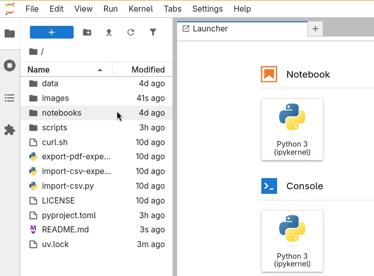
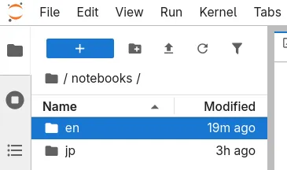
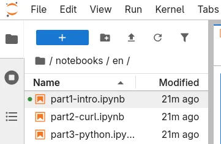
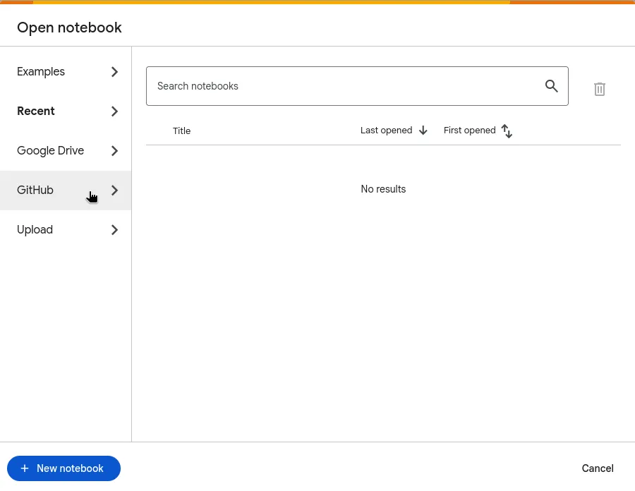
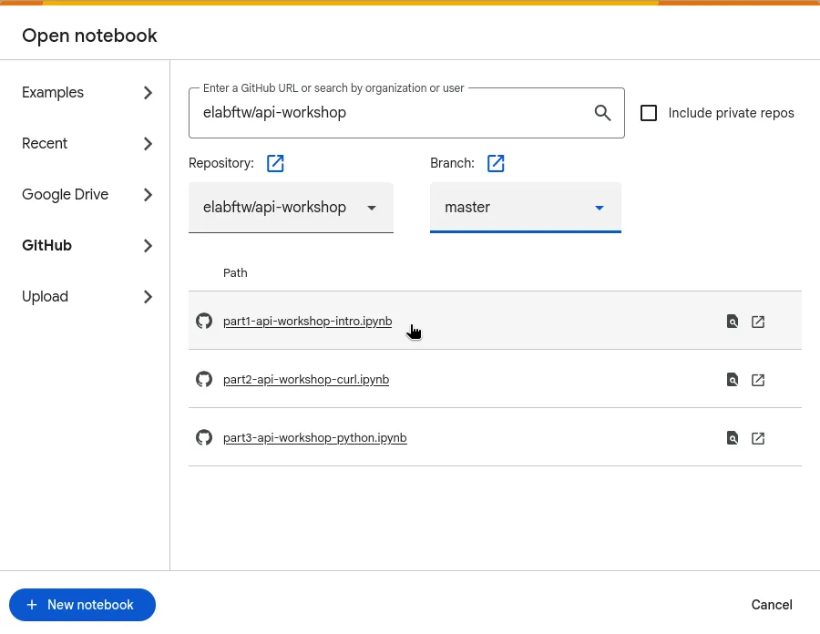

# eLabFTW API Workshop

This repository can be cloned to follow the API workshop proposed by [Deltablot](https://www.deltablot.com).

You can open and run notebooks with [Jupyter](https://jupyter.org/) on your computer ([OPTION 1](#option-1-open-notebooks-locally-with-jupyter)) or use Google Colab ([OPTION 2](#option-2-open-notebooks-with-google-colab)).

## Option 1: open notebooks locally with Jupyter

### Prerequisites

To run the notebooks locally, you will need:
- A terminal (Terminal on Linux/macOS, or [WSL](https://learn.microsoft.com/en-us/windows/wsl/install) on Windows)
- `git` installed

If `git` is not installed, see: https://git-scm.com/downloads

If you don’t want to use the terminal, you can use the **Google Colab** option instead.

We will use `uv` to manage dependencies, see installation instructions: https://github.com/astral-sh/uv?tab=readme-ov-file#installation

___

Open a terminal and run the following commands:

~~~bash
# Clone the repository on your computer
git clone https://github.com/elabftw/api-workshop.git

# Get into the folder
cd api-workshop

# Install dependencies with uv
uv sync --frozen

# Start Jupyterlab
uv run jupyter lab
~~~

If you have followed the above commands, a new window will have opened in your browser, entitled JupyterLab.

In case it did not open, you can also access it directly at: `http://localhost:8888/`.

## Browse the notebooks in JupyterLab

### 1. Double-click on the `notebooks` folder.

### 2. Select your preferred language

_(this only affects the eLabFTW screenshots; the notebook content is in English)_

### 3. Double-click on the `part1-intro.ipynb` to get started with the workshop.

You now only need your eLabFTW instance and the Jupyter notebook open.
You can close this page for better readability.

## Option 2: open notebooks with Google Colab

You can use **Google Colab** to open and run the Jupyter notebooks without installing anything locally.

### Prerequisites

To open and browse the notebooks with Google Colab, you will need a Google account.

### 1. Access  

> **Note**: If you are not logged in, you will be redirected to the “Welcome to Google Colab” page.
Log in, then reopen the link above to access the search page.

### 2. Select GitHub

### 3. Enter this repository's GitHub URL

In the the search bar, type: `elabftw/api-workshop` and press enter
### 4. Select `part1-intro.ipynb`

## Useful links

* Getting started: https://doc.elabftw.net/tutorials/api-workshop
* Api specification documentation: https://doc.elabftw.net/api/v2/
* Python library repository: https://github.com/elabftw/elabapi-python
* HTML documentation: https://doc.elabftw.net/api/elabapi-html/
