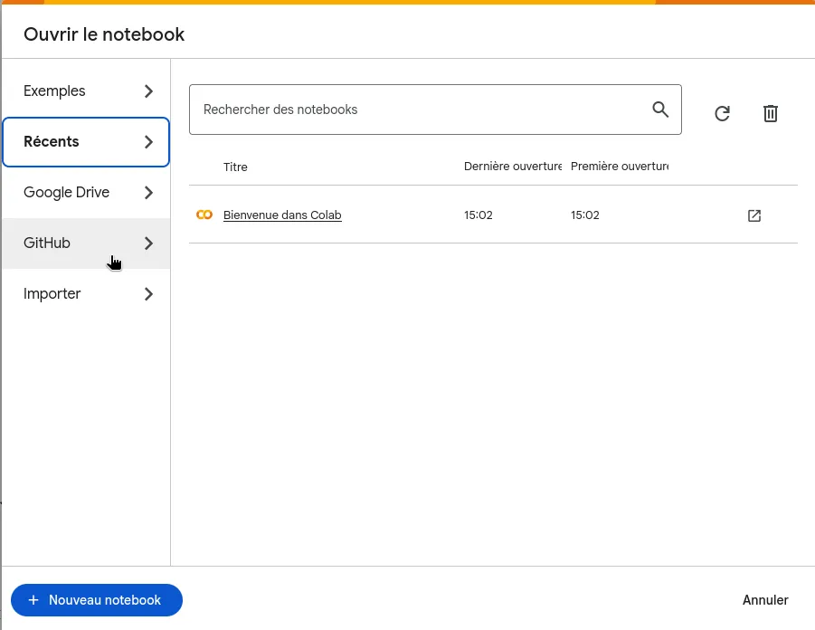
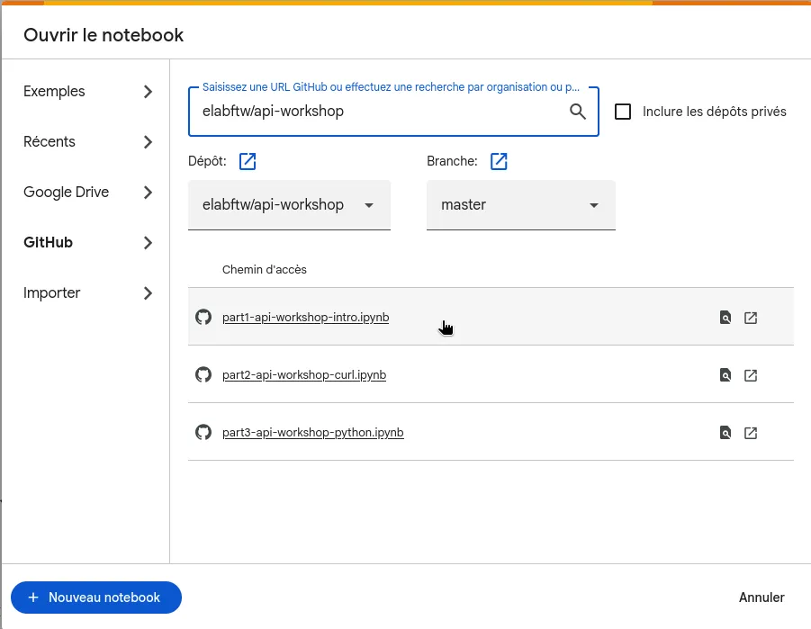

# eLabFTW API Workshop

This repository can be cloned to follow the API workshop proposed by [Deltablot](https://www.deltablot.com).

You can open and run notebooks with [Jupyter](https://jupyter.org/) on your computer (option 1) or use Google Colab (option 2).

## Option 1: open notebooks locally with Jupyter

Note: the commands below assume a GNU/Linux or MacOS operating system. If you are using Windows, it is recommended to ~ditch it~ use [WSL](https://learn.microsoft.com/en-us/windows/wsl/install) or Google Colab option, as it doesn't require to install anything locally on your computer.

We will use `uv` to manage dependencies, see installation instructions: https://github.com/astral-sh/uv?tab=readme-ov-file#installation

~~~bash
# Clone the repository on your computer
git clone https://github.com/elabftw/api-workshop.git

# Get into the folder
cd api-workshop

# Install dependencies with uv
uv sync --frozen

# Start Jupyterlab
uv run jupyter lab
~~~

If you have followed the above commands, a new window will have opened in your browser, entitled JupyterLab.

In case it did not open, you can also access it directly at: `http://localhost:8888/`.

In the left pane:

- double-click on the `notebooks` folder
- Select your language
- double-click on the `part1-intro.ipynb` to get started with the workshop.

## Option 2: open notebooks with Google Colab

You can use Google Colab service to open the Jupyter notebooks.

### 1. Access  
### 2. Select GitHub

### 3. Enter this GitHub URL in the the search bar: `elabftw/api-workshop` and press enter
### 4. Select `part1-intro.ipynb`

## Useful links

* Getting started: https://doc.elabftw.net/api.html
* Api specification documentation: https://doc.elabftw.net/api/v2/
* Python library repository: https://github.com/elabftw/elabapi-python
* HTML documentation: https://doc.elabftw.net/api/elabapi-html/
